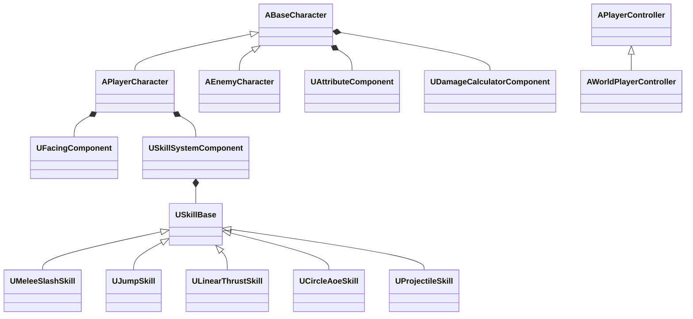

# 类暗黑破坏神 ARPG 游戏策划案

> 引擎：Unreal Engine 5.7  
> 语言：C++  
> 项目名称：Moliser3sGameClient  
> 策划日期：2026/06/11

---

## 一、游戏类型与核心体验

**游戏类型**：俯视角 ARPG（类似《暗黑破坏神》系列）  
**核心玩法**：鼠标点击移动 + 鼠标点击攻击 + 技能连招系统  
**特色**：技能循环队列连招、敌人阵形系统、丰富的 RPG 养成系统

---

## 二、操作与移动

### 2.1 基础操作

| 操作 | 按键 | 说明 |
|------|------|------|
| 移动 | 鼠标右键 | 点击地面 → 角色寻路移动到目标位置 |
| 攻击/释放技能 | 鼠标左键 | 点击敌人或空地 → 释放技能循环队列中的技能 |
| 跳跃 | 左键连招 | 跳跃作为技能类型（UJumpSkill）融入技能循环队列 |
| 走路/奔跑切换 | 自动 | 根据当前朝向模式自动切换速度 |

### 2.2 移动逻辑

- **右键点击地面**：角色使用 NavMesh 寻路移动到目标位置
- **右键点击敌人**：角色移动到距离敌人 `StopDistance`（100cm）的位置停下，并进入**注视模式**（面朝目标）
- **注视模式**：角色面朝锁定目标移动，超过 `LockOnRange`（1000cm）自动切回行走模式
- **速度参数**：
  - 行走模式：WalkSpeed=300, RunSpeed=600
  - 注视模式：LockedWalkSpeed=150, LockedRunSpeed=300

### 2.3 跳跃（✅ 已完成）

- 跳跃作为技能类型（UJumpSkill）融入技能循环队列
- 通过 InterruptibleAt 参数控制是否可空中打断（默认设为大值，全程不可打断）
- 跳跃时停止当前移动 → 播放跳跃蒙太奇 → Character->Jump()
- 跳跃参数：JumpZVelocity=420, AirControl=0.3

---

## 三、技能系统

### 3.1 技能循环队列

玩家通过**鼠标左键**释放技能。每次左键点击会从技能循环队列中读取一个技能执行。

```
技能队列（SkillQueue）:
┌──────┬──────┬──────┬──────┐
│ 技能A │ 技能B │ 跳跃 │ 技能C │
└──┬───┴──┬───┴──┬───┴──┬───┘
   │      │      │      │
   └──▶ 循环释放，到末尾回到开头
```

### 3.2 连招机制（✅ 已完成）

技能释放采用 **连招窗口 + 打断** 机制：

```
技能系统状态机：

        ActivateNextSkill()
              │
              ▼
   ┌───────────────────┐
   │    IDLE（空闲）     │ ◀─────────────────────────┐
   └────────┬──────────┘                            │
            │ 执行技能（QueueIndex 指向的技能）        │
            ▼                                        │
   ┌───────────────────┐                            │
   │  ACTIVE（播放中）   │                            │
   │  ├─ DamageAt 触发伤害                            │
   │  └─ Duration 倒计时                              │
   └────────┬──────────┘                            │
            │ Duration 到期                           │
            ▼                                        │
   ┌───────────────────┐                            │
   │ COMBO_WINDOW(0.5s)│                            │
   └──┬───────────────┘                            │
      │                    │                         │
      │ 再次左键            │ 超时                    │
      │ ActivateNextSkill  │                         │
      │ → 下一个技能        │ → QueueIndex=0           │
      ▼                    ▼                         │
   ACTIVE               IDLE ────────────────────┘

打断逻辑（在 ACTIVE 状态下点击左键）：
  elapsed < InterruptibleAt → 忽略点击（不可打断）
  elapsed >= InterruptibleAt → 打断当前技能 → 执行下一个
```

**关键逻辑**：
- 技能释放后 → 进入 ACTIVE 状态，Tick 检测 `DamageAt` 和 `Duration`
- `DamageAt` 时间点到达 → 触发技能伤害
- `Duration` 到期后 → 进入 COMBO_WINDOW（0.5 秒连招窗口）
- 窗口期内再次左键 → 执行队列中的下一个技能
- 窗口期内没操作 → 重置队列索引到 0，回到 IDLE
- ACTIVE 期间点击左键 → 判断是否过 `InterruptibleAt`，可打断则提前终止

### 3.3 技能类型

#### 类型一：扇形斩击（UMeleeSlashSkill ✅ 已完成）

```
检测方式：SphereOverlap + 扇形角度过滤
参数：
  Radius      = 100~150 cm（攻击距离）
  HalfAngleDeg = 30~45°（扇形角度）
  BaseDamage   = 自定义
  Duration     = 0.4~0.8s（对应动画长度）
  MaxZDiff     = 150 cm（最大高度差）
```

#### 类型二：跳跃（UJumpSkill ✅ 已完成）

```
执行方式：停止移动 → 播放蒙太奇 → Character->Jump()
参数：
  Duration      = 0.8s（匹配跳跃落地时间）
  InterruptibleAt = 999（默认不可打断）
  SkillMontage  = 跳跃蒙太奇（可选）
```

#### 类型三：直线穿刺（ULinearThrustSkill ⬜ 待开发）

```
检测方式：BoxOverlap 或多条 LineTrace
参数：
  Range       = 300~500 cm（攻击距离）
  Width       = 50~100 cm（宽度）
  BaseDamage  = 自定义
  Duration    = 0.3~0.6s
```

#### 类型四：圆形范围（UCircleAoeSkill ⬜ 待开发）

```
检测方式：SphereOverlap，不限制角度
参数：
  Radius      = 150~300 cm
  BaseDamage  = 自定义
  Duration    = 0.5~1.0s
```

#### 类型五：飞行投射物（UProjectileSkill ⬜ 待开发）

```
需要额外资源：
  - 投射物 Actor 类（APlayerProjectile）
  - 碰撞检测在投射物 Tick 或 OnHit 中处理
参数：
  ProjectileClass = TSubclassOf<AActor>
  Speed           = 飞行速度
  BaseDamage      = 自定义
  Duration        = 飞行最大时间（超时销毁）
```

### 3.4 技能配置

所有技能参数暴露给蓝图，在 `SkillSystemComponent` 的 `SkillList` 中直接配置技能实例：

| 属性 | 说明 |
|------|------|
| SkillName | 技能名称 |
| Duration | 技能持续时间（秒） |
| DamageAt | 伤害触发时间点（动画的"命中帧"） |
| InterruptibleAt | 可打断时间点（超过可提前释放下一个技能） |
| SkillMontage | 播放的蒙太奇动画 |
| MontageSlotName | 蒙太奇槽位名称（与蒙太奇内部 Slot Track 名称一致） |
| Radius | 攻击半径（扇形技能） |
| HalfAngleDeg | 扇形角度（扇形技能） |
| BaseDamage | 基础伤害 |
| MaxZDiff | 最大高度差 |

---

## 四、游戏系统

### 4.1 装备系统（⬜ 待开发）

```
装备品质：
  白色（普通）→ 蓝色（魔法）→ 金色（稀有）→ 暗金（传奇）

装备部位：
  头盔 / 胸甲 / 武器 / 护腿 / 靴子 / 戒指 / 项链

装备属性：
  - 基础属性（护甲、攻击力、血量加成）
  - 插槽数量（0~4 孔）
  - 随机词缀系统

数据结构：
  UEquipmentItem（UObject）
    - ItemName, Rarity, Slot 类型
    - BaseStats: TArray<FEquipmentStat>
    - SocketCount: int32
    - SocketedGems: TArray<UGemItem*>
```

### 4.2 背包系统（⬜ 待开发）

```
  - 网格式背包 UI（类似暗黑风格）
  - 装备/消耗品栏位分类
  - 拖拽操作（移动、装备、丢弃）
  - 自动拾取功能
```

### 4.3 商店系统（⬜ 待开发）

```
  - 购买物品（消耗金币）
  - 出售物品（获得金币）
  - 定期刷新商品列表
  - NPC 好感度影响价格（见好感度系统）
```

### 4.4 打造装备系统（⬜ 待开发）

```
  - 消耗材料 + 金币 → 生成随机装备
  - 材料品质影响产出品质
  - 可指定装备类型（武器/防具）
  - 打造出的装备可能带有额外词缀
```

### 4.5 宝石合成系统（⬜ 待开发）

```
合成规则：
  - 3 颗同等级宝石 → 1 颗更高级宝石
  - 等级上限：10 级

宝石类型：
  - 红宝石 → 攻击力
  - 蓝宝石 → 法力上限
  - 绿宝石 → 暴击率
  - 黄宝石 → 防御力
```

### 4.6 宝石镶嵌系统（⬜ 待开发）

```
规则：
  - 装备有孔（SocketCount > 0）才能镶嵌
  - 镶嵌后宝石属性叠加到装备
  - 可移除宝石（消耗金币，宝石不返还）
  - 不同装备部位可能有宝石类型限制
```

### 4.7 NPC 好感度系统（⬜ 待开发）

```
好感度范围：0~100

好感度阶段：
  0~20:   冷淡（基础交易）
  21~50:  友好（9 折优惠）
  51~80:  亲密（8 折 + 隐藏商品）
  81~100: 信任（7 折 + 专属任务）

机制：
  - 赠送特定礼物提升好感度
  - 部分任务需要达到指定好感度才能解锁
  - 完成 NPC 的支线任务也会提升好感度
```

---

## 五、任务系统（⬜ 待开发）

### 5.1 任务结构

```
任务类型：
  - 主线任务（链式推进）
  - 支线任务（自由选择）

任务目标类型：
  - 击杀目标（Kill）
  - 收集物品（Collect）
  - 与 NPC 对话（Talk）
  - 到达指定位置（Reach）

数据结构：
  UQuest（UObject）
    - QuestId, QuestName, Description
    - bIsMainQuest
    - Objectives: TArray<FQuestObjective>
    - Rewards: TArray<FQuestReward>
```

### 5.2 主线任务链

```
Act 1 → Act 2 → Act 3 → Act 4 → Act 5
每个 Act 包含 5~8 个连续任务
逐步推进剧情，解锁新地图和玩法
```

### 5.3 支线任务

```
  - 分布在各区域，由 NPC 触发
  - 解锁条件：好感度 / 主线进度 / 角色等级
  - 奖励：经验、装备、材料、金币
```

---

## 六、AI 与敌人系统

### 6.1 敌人基础（AEnemyCharacter ⚠️ 基础框架已有）

需要在现有 `AEnemyCharacter` 基础上添加：

```
  - AI 感知组件（UAIPerceptionComponent）：视觉、听觉
  - 行为树（BehaviorTree）：巡逻 → 发现 → 追击 → 攻击
  - 与玩家共用 SkillSystemComponent 和技能类
  - 近战敌人：UMeleeSlashSkill
  - 远程敌人：UProjectileSkill
  - 精英/Boss：完整连招队列
```

### 6.2 阵形系统（⬜ 待开发 — 核心特色）

```
概念：
  多个敌人组成阵形，每个敌人有相对阵形中心的偏移位置。
  阵形中心跟随 Leader 移动。

阵形类型：
  - 横排阵：一字排开，正面推进
  - 包围阵：圆形包围玩家
  - V字阵：尖刀突击阵形
  - 散兵阵：松散站位，自由攻击

实现架构：
  1. UFormationManagerComponent（阵形管理器）
     - 绑定到阵形 Leader
     - 管理阵形类型、成员列表、偏移位置

  2. 每个阵形成员通过行为树获取"阵形目标位置"
     - 目标位置 = Leader位置 + 成员偏移（旋转对齐）

  3. 行为逻辑：
     - 玩家进入警戒范围 → 阵形整体向玩家推进
     - 达到攻击距离 → 阵形暂停 → 成员按顺序释放技能
     - 玩家移动 → 阵形保持相对位置跟进的

阵形偏移示例（横排）：
  FVector GetFormationSlotLocation(int32 MemberIndex)
  {
      float Spacing = 150.0f;
      float OffsetX = (MemberIndex - (MemberCount-1)/2.0f) * Spacing;
      return LeaderLocation + LeaderRight * OffsetX;
  }
```

---

## 七、当前开发进度

### 已完成（✅）

| 模块 | 说明 |
|------|------|
| 角色基础类 | ABaseCharacter，血量/法力/速度参数 |
| 玩家角色 | APlayerCharacter，FacingComponent、SkillSystemComponent |
| 敌人类 | AEnemyCharacter，基础移动参数 |
| 属性组件 | UAttributeComponent，血量/法力/攻击/防御属性 |
| 伤害计算组件 | UDamageCalculatorComponent，计算最终伤害（含暴击） |
| 朝向组件 | UFacingComponent，行走/注视模式切换 |
| 技能基类 | USkillBase，SkillName/Duration/DamageAt/InterruptibleAt/蒙太奇属性 |
| 扇形斩击技能 | UMeleeSlashSkill，扇形范围伤害（延迟触发） |
| 跳跃技能 | UJumpSkill，跳跃融入技能循环队列 |
| 技能系统组件 | USkillSystemComponent，技能队列/连招窗口/打断机制/延迟伤害 |
| 技能蒙太奇播放 | PlaySkillMontage()，播放蒙太奇动画 |
| 连招窗口机制 | IDLE→ACTIVE→COMBO_WINDOW 三态机（0.5s窗口） |
| 技能打断机制 | InterruptibleAt 控制，超过可打断 |
| 延迟伤害 | DamageAt 时间点触发 ApplyDamage |
| 玩家控制器 | AWorldPlayerController，左键攻击/右键移动 |
| 点击检测组件 | UClickDetectionComponent，屏幕射线检测 |

### 待开发（⬜）

| 优先级 | 模块 | 预估工时 |
|--------|------|---------|
| P1 | 直线穿刺技能 ULinearThrustSkill | 1-2 天 |
| P1 | 圆形范围技能 UCircleAoeSkill | 1-2 天 |
| P1 | 飞行投射物技能 UProjectileSkill | 2-3 天 |
| P1 | 敌人 AI 感知 + 行为树 | 3-4 天 |
| P2 | 装备数据结构 + 背包 UI | 5-7 天 |
| P2 | 商店系统 | 2-3 天 |
| P2 | 任务系统框架 | 5-7 天 |
| P3 | 阵形系统 | 5-7 天 |
| P3 | 好感度系统 | 3-4 天 |
| P3 | 打造/宝石系统 | 4-5 天 |

---

## 八、技术架构说明

### 8.1 项目结构（Source 目录）

```
Moliser3sGameClient/Source/
├── BaseCharacter.h/.cpp          # 基础角色类
├── PlayerCharacter.h/.cpp        # 玩家角色
├── EnemyCharacter.h/.cpp         # 敌人角色
├── WorldPlayerController.h/.cpp  # 玩家控制器
├── WorldGameMode.h/.cpp          # 游戏模式
├── Component/
│   ├── Attribute/                # 属性组件（血量/法力/攻防）
│   ├── Damage/                   # 伤害计算组件
│   ├── Facing/                   # 朝向控制组件
│   ├── Input/                    # 点击检测组件
│   └── Skill/                    # 技能系统组件
└── Skill/
    ├── SkillBase.h/.cpp          # 技能基类
    ├── MeleeSlashSkill.h/.cpp    # 扇形斩击技能 ✅
    ├── JumpSkill.h/.cpp          # 跳跃技能 ✅
    ├── LinearThrustSkill/        # ⬜ 直线穿刺技能
    ├── CircleAoeSkill/           # ⬜ 圆形范围技能
    └── ProjectileSkill/          # ⬜ 飞行投射物技能
```

### 8.2 关键类图



---

## 九、开发路线图

```

第一阶段：基础完善（已完成 ✅）
  ├─ [✅] 修复左键多技能 Bug
  ├─ [✅] 技能循环队列 + Duration 控制
  ├─ [✅] 蒙太奇动画播放
  ├─ [✅] 跳跃功能（技能类型）
  └─ [✅] 连招窗口机制 + 打断 + 延迟伤害

第二阶段：技能扩展（当前阶段）
  ├─ [⬜] 直线穿刺技能
  ├─ [⬜] 圆形范围技能
  ├─ [⬜] 飞行投射物技能
  └─ [⬜] 敌人共用技能系统

第三阶段：RPG 系统
  ├─ [⬜] 装备数据结构 + UI
  ├─ [⬜] 背包系统
  ├─ [⬜] 商店系统
  └─ [⬜] 任务框架

第四阶段：特色系统
  ├─ [⬜] 阵形 AI 系统
  ├─ [⬜] NPC 好感度系统
  ├─ [⬜] 打造 + 宝石系统
  └─ [⬜] 调试与平衡性调整
```

---

> 本文档将随项目开发持续更新。  
> 最后更新：2026/06/11